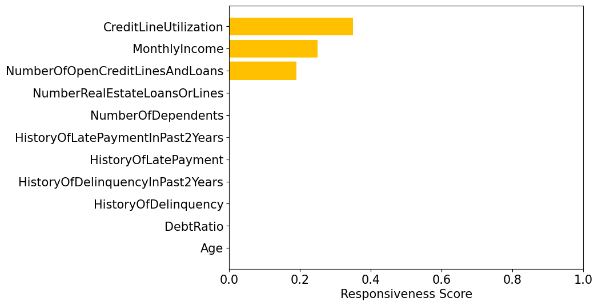

# reachml

[](https://www.python.org)
[](https://opensource.org/licenses/MIT)
[](https://arxiv.org/abs/2308.12820)
[](https://arxiv.org/abs/2410.22598)
[](https://github.com/ustunb/reachml/actions/workflows/ci.yml)

`reachml` is a library for recourse verification.

## Background

*Recourse* is the ability of a decision subject to change the prediction of a machine learning model through actions on their features. *Recourse verification* aims to tell if a decision subject is assigned a prediction that is fixed.

## Installation

You can install the library as follows:
```
pip install "git+https://github.com/ustunb/reachml#egg=reachml[cplex]"
```

Many of the functions in `reach-ml` will require [CPLEX](https://www.ibm.com/products/ilog-cplex-optimization-studio) to run properly. The command above will install CPLEX Community Edition. The community edition has a strict limit on the number of constraints it can support. To avoid these, you will want install reachml without the cplex option, and download and install the full version of IBM CPLEX [following these instructions](https://github.com/ustunb/docs/cplex_instructions.md).


## Responsiveness Scores Quickstart

The following example shows how to generate responsivneess scores using `ResponsivenessScorer`.

```python
import numpy as np
import xgboost

import reachml

# load dataset and train xgboost classifier
X, y = reachml.datasets.givemecredit_cts_slim(label=[0, 1])
model = xgboost.XGBClassifier().fit(X, y)

# create simple action set
A = reachml.ActionSet(X)

# Immutable features
A["HistoryOfDelinquency"].actionable = False
A["HistoryOfLatePayment"].actionable = False

# MonthlyIncome can change +- 5000
A["MonthlyIncome"].step_ub = 5000
A["MonthlyIncome"].step_lb = -5000

# CreditLineUtilization can change +- 1
A["CreditLineUtilization"].step_ub = -1
A["CreditLineUtilization"].step_lb = 1

# Min CreditLineUtilization is 0
A["CreditLineUtilization"].lb = 0

# Calculate responsiveness scores
# Since some features are continuous, we set sample size: n = 100
scorer = reachml.ResponsivenessScorer(A)
scores = scorer(X, model, n=100)

# List of adverse outcome indices
rejected = np.where(model.predict(X) == 0)[0]

# Plot output (pass in index)
scorer.plot(x_idx=rejected[0])
```
<p align="center">
  
</p>

### Resources and Citation

For more about responsiveness scores, check out our paper ICLR 2025 paper: [Feature Responsiveness Scores: Model-Agnostic Explanations for Recourse](https://openreview.net/forum?id=wsWCVrH9dv)

If you use responsiveness scores in your research, we would appreciate a citation:

```
@inproceedings{
    cheon2025feature,
    title={Feature Responsiveness Scores: Model-Agnostic Explanations for Recourse},
    author={Seung Hyun Cheon and Anneke Wernerfelt and Sorelle Friedler and Berk Ustun},
    booktitle={The Thirteenth International Conference on Learning Representations},
    year={2025},
    url={https://openreview.net/forum?id=wsWCVrH9dv}
}
```

The code for the paper is available under [research/iclr2025](https://github.com/ustunb/reachml/tree/main/research/iclr2025/).


## Reachable Sets Quickstart

The following example shows how to specify actionability constraints using `ActionSet` and to build a database of `ReachableSet` for each point.

```python
import pandas as pd
from reachml import ActionSet, ReachableSet, ReachableDatabase
from reachml.constraints import OneHotEncoding, DirectionalLinkage

# feature matrix with 3 points
X = pd.DataFrame(
    {
        "age": [32, 19, 52],
        "marital_status": [1, 0, 0],
        "years_since_last_default": [5, 0, 21],
        "job_type_a": [0, 1, 1], # categorical feature with one-hot encoding
        "job_type_b": [1, 0, 0],
        "job_type_c": [0, 0, 0],
    }
)

# Create an action set
action_set = ActionSet(X)

# `ActionSet` infers the type and bounds on each feature from `X`. To see them:
print(action_set)

## print(action_set) should return the following output
##+---+--------------------------+--------+------------+----+----+----------------+---------+---------+
##|   | name                     |  type  | actionable | lb | ub | step_direction | step_ub | step_lb |
##+---+--------------------------+--------+------------+----+----+----------------+---------+---------+
##| 0 | age                      | <int>  |   False    | 19 | 52 |              0 |         |         |
##| 1 | marital_status           | <bool> |   False    | 0  | 1  |              0 |         |         |
##| 2 | years_since_last_default | <int>  |    True    | 0  | 21 |              1 |         |         |
##| 3 | job_type_a               | <bool> |    True    | 0  | 1  |              0 |         |         |
##| 4 | job_type_b               | <bool> |    True    | 0  | 1  |              0 |         |         |
##| 5 | job_type_c               | <bool> |    True    | 0  | 1  |              0 |         |         |
##+---+--------------------------+--------+------------+----+----+----------------+---------+---------+

# Specify constraints on individual features
action_set[["age", "marital_status"]].actionable = False # these features cannot or should not change
action_set["years_since_last_default"].ub = 100 # set maximum value of feature to 100
action_set["years_since_last_default"].step_direction = 1 # actions can only increase value
action_set["years_since_last_default"].step_ub = 1 # limit actions to changes value by 1

# Specify constraint to maintain one hot-encoding on `job_type`
action_set.constraints.add(
    constraint=OneHotEncoding(names=["job_type_a", "job_type_b", "job_type_c"])
)

# Specify deterministic causal relationships
# if `years_since_last_default` increases, then `age` must increase commensurately
# This will force `age` to change even though it is not immediately actionable
action_set.constraints.add(
    constraint=DirectionalLinkage(
        names=["years_since_last_default", "age"], scales=[1, 1]
    )
)

# Check that `ActionSet` is consistent with observed data
# For example, if features must obey one-hot encoding, this should be the case for X
assert action_set.validate(X)

# Build a database of reachable sets for all points
db = ReachableSetDatabase(action_set, path="reachable_db.h5") #database stored in file `./reachable_db.h5`
db.generate(data, overwrite=True)

# Pull reachable set for first point in dataset
x = data.iloc[0]
reachable_set = db[x]
print(reachable_set) # should return the following output:
##    age  marital_status  years_since_last_default  job_type_a  job_type_b  job_type_c
## 0  32.0             1.0                       5.0         0.0         1.0         0.0
## 1  32.0             1.0                       5.0         0.0         0.0         1.0
## 2  32.0             1.0                       5.0         1.0         0.0         0.0
## 3  33.0             1.0                       6.0         0.0         0.0         1.0
## 4  33.0             1.0                       6.0         0.0         1.0         0.0
## 5  33.0             1.0                       6.0         1.0         0.0         0.0
```
Given a classifier `clf` with a predict method, you can test if a point has recourse as `np.any(clf.predict(reachable_set.X))`

For more examples, check out [this
script](https://github.com/ustunb/reachml/blob/main/research/iclr2024/scripts/setup_dataset_actionset_fico.py) which sets up the action set for the FICO dataset.

### Resources and Citation

For more about recourse verification, check out our paper ICLR 2024 spotlight paper: [Prediction without Preclusion](https://openreview.net/forum?id=SCQfYpdoGE)

If you use recourse verification in your research, we would appreciate a citation:
```
@inproceedings{kothari2024prediction,
    title={Prediction without Preclusion: Recourse Verification with Reachable Sets},
    author={Avni Kothari and Bogdan Kulynych and Tsui-Wei Weng and Berk Ustun},
    booktitle={The Twelfth International Conference on Learning Representations},
    year={2024},
    url={https://openreview.net/forum?id=SCQfYpdoGE}
}
```

The code for the paper is available under [research/iclr2024](https://github.com/ustunb/reachml/tree/main/research/iclr2024/).
